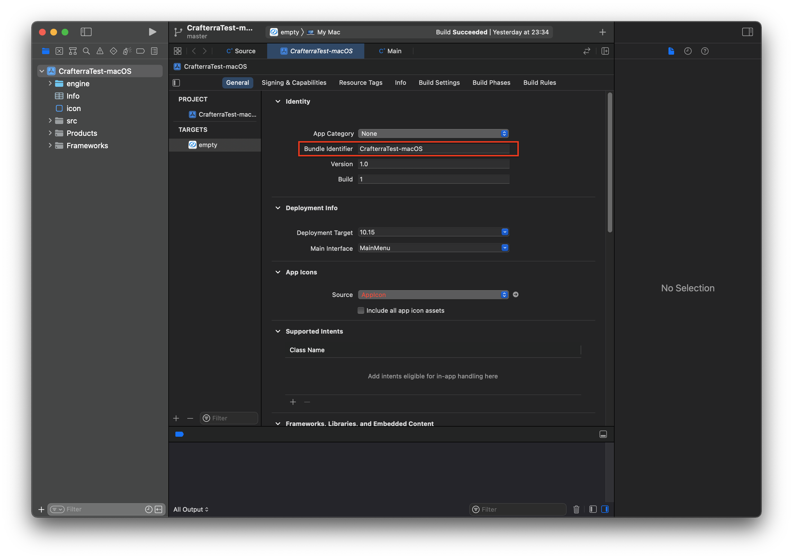
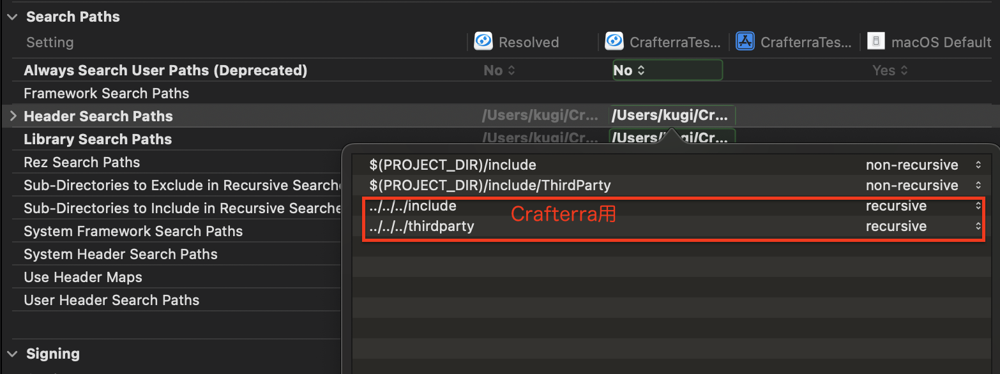
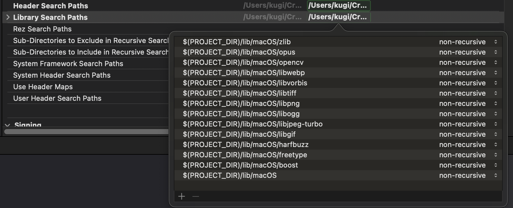
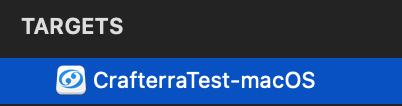
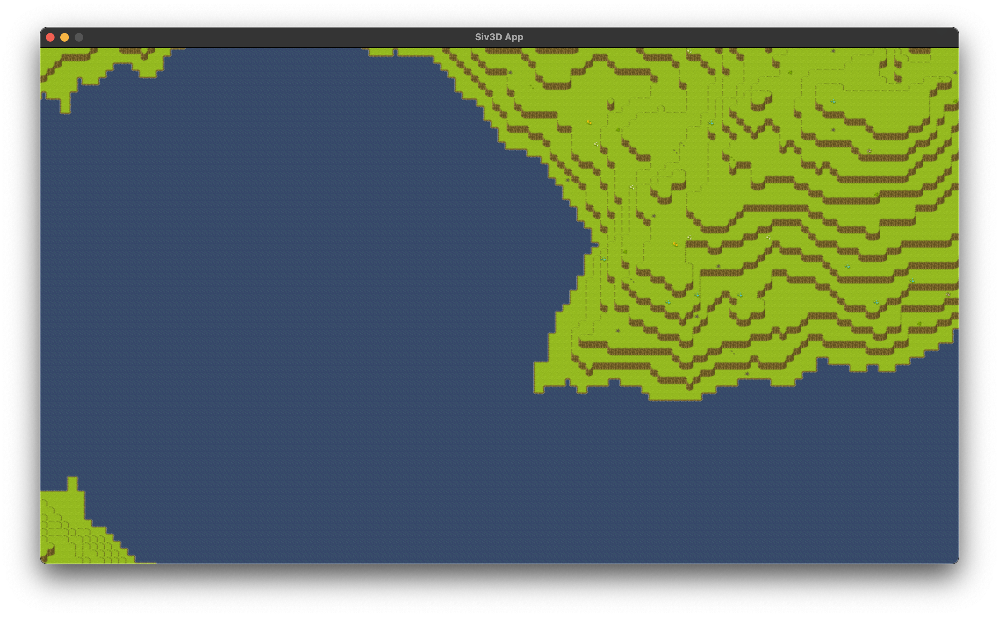

# CrafterraTest-macOS

OpenSiv3Dを用いたmacOSへのセットアップ方法

## 動作確認済み環境

- Xcode 13.2.1
- macOS Big Sur 11.6

## 導入方法

### 1. [macOS用のSiv3D SDK](https://zenn.dev/reputeless/books/siv3d-documentation/viewer/setup#2.-macos-%E3%81%A7-siv3d-%E3%82%92%E5%A7%8B%E3%82%81%E3%82%8B)のダウンロード

### 2. サンプルプロジェクトを流用
 `{SDKフォルダ}/examples/empty` をコピーし `CrafterraTest-macOS` とリネームします。(プロジェクトディレクトリ [CrafterraTest-macOS](/CrafterraTest-macOS))

`{SDKフォルダ}/include` と `{SDKフォルダ}/lib`を`CrafterraTest-macOS`にコピーします。(サンプルプロジェクトのディレクトリ構成と異なるので注意)

`CrafterraTest-macOS/empty.xcodeproj`を`CrafterraTest-macOS/CrafterraTest-macOS.xcodeproj`にリネームしてXcodeで開きます。(名称はなんでも良い)

図のように**Bundle Identifier**を**CrafterraTest-macOS**に変更します。(名称はなんでも良い)

### 3. ライブラリとヘッダファイルのパスを指定
先程の設定でSiv3Dのサンプルプロジェクトとはディレクトリ構成が変わってしまったので、パスを再設定します。
また、ついでにCrafterra用のライブラリパスなども指定しましょう。

`Targets > Build Settings > Search Paths`

から以下を設定します。

#### 3.1 Header Search Pathsの設定

- recursive : 指定したパスのサブディレクトリまで検索対象
- non-recursive : サブディレクトリについてはチェックしない

#### 3.2 Library Search Pathsの設定

ついでにTarget名も変えておきましょう。

(名称はなんでも良い)

### 4. プロジェクトのビルド
実行ファイルは [CrafterraTest/Source.cpp](../../CrafterraTest/CrafterraTest/Source.cpp)になります。

**Product > Run** で実行して、無事に動いてくれることを祈りましょう🙏

)

無事に実行できましたね🎉

## その他

macOSでのセットアップで何かお困りの際は、[**@kugimasa**](https://github.com/kugimasa) までお願いします。
